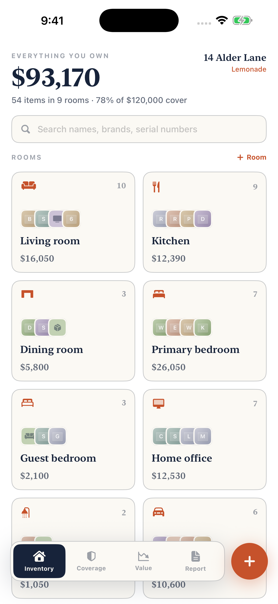
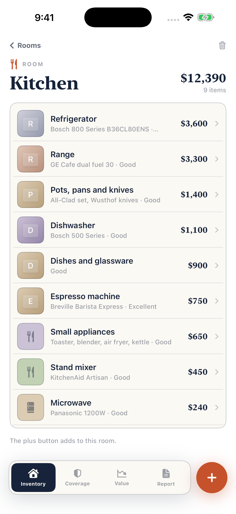
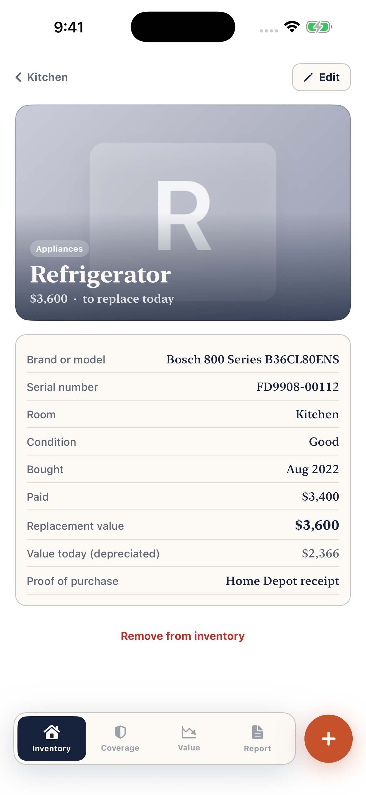

# Rooms

A home inventory for iPhone you can actually finish, with a coverage check and an insurance claim report.

  

**Coming to the App Store.**

<p align="center">
  
  
  
</p>

Everyone is told to keep a home inventory for insurance and almost nobody does, because it feels like homework. Stand in a room, photograph what is in it, type a name and what it would cost to replace: thirty seconds an item, and the record is ready the day something goes wrong.

## Features

- Rooms as labelled boxes with running totals; items with photo, brand, serial, quantity, dates, price, replacement value, condition, receipt location
- Quick-add chips for common things with typical values filled in; search by name, brand or serial
- Coverage check: contents cover, deductible and the special caps on jewelry, cash, firearms and art, with red flags where you are over
- Replacement cost beside estimated cash value, depreciated over each category's useful life
- A high-value list that shows what is missing for a claim: no serial, no photo, no proof
- A multi-page PDF claim report room by room, a spreadsheet (CSV) export, and an after-a-loss checklist

## Price

A paid app: one price, no in-app purchases, no subscription, no ads.

## Privacy

No network code at all: Rooms makes no requests and collects no data. Photos and records stay on the device (`rooms.json` plus the photos you attach). The privacy manifest (`Resources/PrivacyInfo.xcprivacy`) declares no tracking and no collected data types.

## Built without a Mac

This app was written on a Windows PC. No Mac is involved at any point: every build, signature, screenshot and App Store submission runs on GitHub Actions macOS runners, driven by the App Store Connect API.

- **`project.yml`** is an [XcodeGen](https://github.com/yonaskolb/XcodeGen) spec. The `.xcodeproj` is generated on the runner and never committed, so the repo can be edited on any OS and there are no `.pbxproj` merge conflicts.
- **`.github/workflows/build.yml`** runs on every push: picks the newest Xcode 26 and iPhone simulator on the runner, builds, then launches the app once per screen with `-shot <screen>` (sample data, fixed 9:41 status bar) and captures the store screenshots with `simctl`, uploaded as a workflow artifact.
- **`.github/workflows/appstore.yml`** (manual) has three modes: `compile`, `dry_run` (build, sign, upload, do not submit) and `release` (also submits for review). The distribution certificate is imported from a secret into a throwaway keychain; [fastlane](https://fastlane.tools) (`fastlane/Fastfile`) fetches the App Store profile with the API key, sets the build number one above the latest on TestFlight, archives, and uploads the binary with `fastlane/metadata` and the committed `fastlane/screenshots`.
- **`.github/workflows/review-video.yml`** records the App Review screen recording: the app is launched with `-demoAutoplay` and drives its own real screens.
- **`Store/*.py`** talk to the App Store Connect API directly from Windows (Python, `requests` + `PyJWT`): `asc.py` registers the bundle id and pushes metadata, `listing.py` sets the age rating, review details, price and screenshots, and `signing.py` creates the distribution certificate locally so its private key is never stranded on a disposable runner.

Only one step is manual: Apple's API will not create the app record itself, so that is made once in the App Store Connect web UI.

## Build and run

With a Mac and Xcode 26 (the version CI uses; the app targets iOS 17+):

```bash
brew install xcodegen
xcodegen generate
open Rooms.xcodeproj
```

Run the `Rooms` scheme on any iPhone simulator. No signing is needed for the simulator; from the command line:

```bash
xcodebuild build -project Rooms.xcodeproj -scheme Rooms \
  -destination 'platform=iOS Simulator,name=iPhone 16 Pro' CODE_SIGNING_ALLOWED=NO
```

To see it filled with sample data, launch with a screenshot argument, e.g. `xcrun simctl launch booted com.mattbusel.rooms -shot home`.

Without a Mac: fork the repo and push. The Build workflow compiles it on a GitHub macOS runner and attaches the screenshots as an artifact.

Shipping your own build needs these repository secrets: `ASC_KEY_ID`, `ASC_ISSUER_ID`, `ASC_KEY_CONTENT` (base64 of the `.p8`), `DEVELOPMENT_TEAM`, `DIST_CERT_P12`, `DIST_CERT_PASSWORD`, plus your own bundle id in `project.yml` and `fastlane/Fastfile`.

## Code map

All app code is in `Sources/` (SwiftUI, Observation, no third-party dependencies).

| File | What it does |
| --- | --- |
| `App.swift` | entry point, `-shot` handling |
| `Model.swift` | rooms, items, depreciation, coverage maths, JSON persistence |
| `Views.swift` | inventory, rooms, coverage and high-value screens |
| `Editor.swift` | the item editor with camera and photo library |
| `Report.swift` | the PDF claim report and CSV export |
| `Theme.swift` | paper-ledger look |
| `Demo.swift` / `Autopilot.swift` | screenshot data and the App Review recording |

`Store/` holds the App Store Connect scripts, `fastlane/` the lanes, listing text and screenshots, `Resources/` the asset catalog and privacy manifest.

---

**More apps built the same way:** [Chain](https://github.com/Mattbusel/chain), [Ironbook](https://github.com/Mattbusel/ironbook), [Quiver](https://github.com/Mattbusel/quiver), [Race Fuel](https://github.com/Mattbusel/race-fuel), [Minder](https://github.com/Mattbusel/minder), [Baseline Ledger](https://github.com/Mattbusel/baseline-ledger), [Fairway Ledger](https://github.com/Mattbusel/fairway-ledger), [Odometer](https://github.com/Mattbusel/odometer), [Clockout](https://github.com/Mattbusel/clockout), [Curve](https://github.com/Mattbusel/curve), [Pricebook](https://github.com/Mattbusel/pricebook), [Chores](https://github.com/Mattbusel/chores), [Pawprint](https://github.com/Mattbusel/pawprint), [Pocket Beings](https://github.com/Mattbusel/pocket-beings), [Glyphstorm](https://github.com/Mattbusel/glyphstorm), [Clear the Strait](https://github.com/Mattbusel/clear-the-strait).


## Hire the author

I designed, built and shipped this app myself. **Want one like it for your business?** I build native iOS apps from prototype to App Store launch, fixed price. [Services and pricing](https://mattbusel.github.io/) · [Email](mailto:mattbusel@gmail.com) · [LinkedIn](https://www.linkedin.com/in/matthewbusel/)
